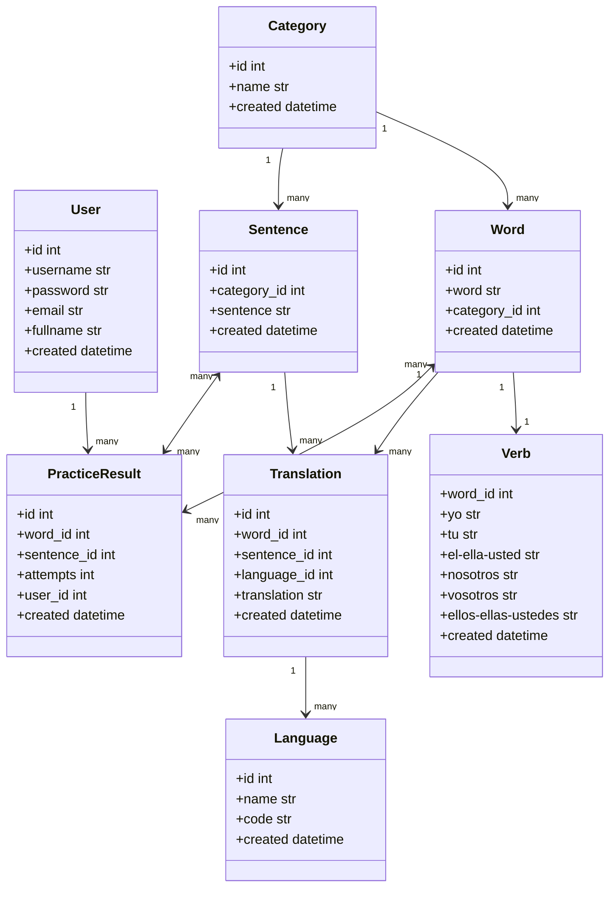

# Spanglish API
--------------
is an API created to help me learn the spanish language. It is the main backend that will contain all the words, sentences, and translations I learn every day. I can add, modify and get all words, sentences and their translations. The words and sentences will be categorized. The main language for the translation here is English. But it can also be another language. The goal of this backend is not to build a dictionary, but a tool with quizes that help me learn the language on my own way. It can have a front-end to fetch words or sentences, make questions and saves answers and results. The results can show me how my mistakes and which category can I improve my self in.
This api is built using Python FastAPI.

## Changelogs
All change logs can be found [here](CHANGELOG.md)

## Authors
Omar Aljazairy: omar@fedal.nl

## Class Diagram
----------------

## Usage
--------

- To start the app, first run the container:
  make start 
- To enter the container
  make bash
- To unittest the application
  make test
