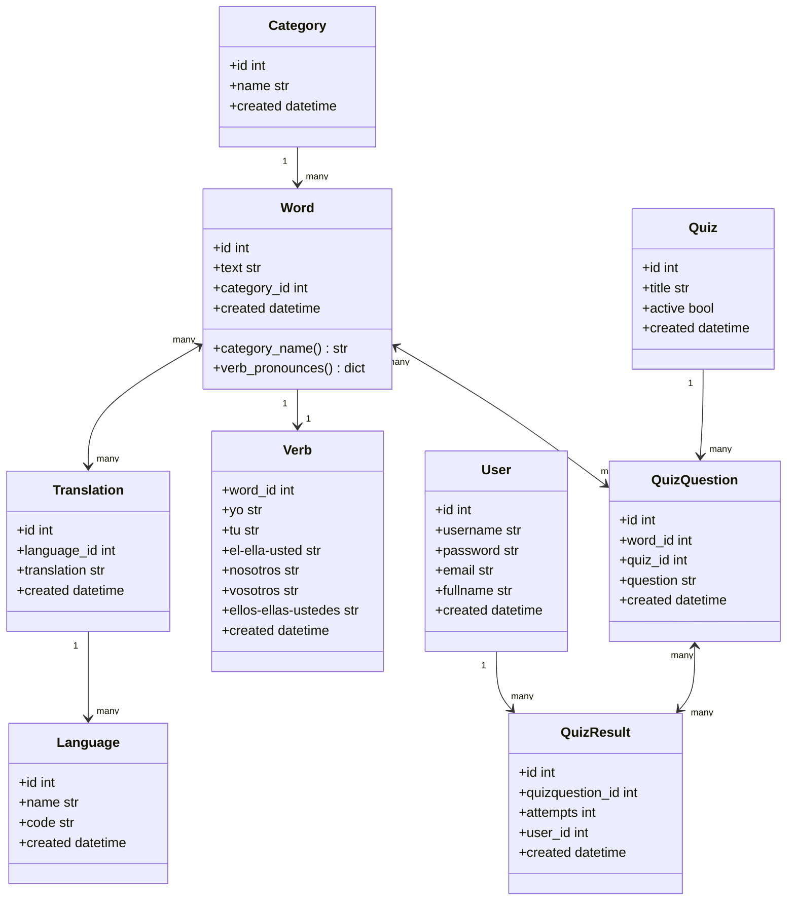

# Spanglish API
--------------
This API is used as a backend system where Spanish words or sentences can be added and translated. It supports creating quizzes with quiz questions existing from the Spanish words. The results of the quizzes can be added here and fetched. 
Any interface can use it as a backend.
This api is built using Python 3.9 and FastAPI with PostgreSQL as a database.

## Usage & endpoints
--------------------
- /language/ : post, get, patch and delete a language that will be used for the translation.
- /category/ : post, get and patch categories. each word text will have a category, for example Days, Months, Verbs, ... etc.
- /word/ : post, get and patch Spanish texts. Each word has a category linked to it.
- /verb/ : post, get and patch a verb pronounce. A verb is linked to a word that has to have the category `Verb`. 
- /translation/ : post, get and patch a translation for each word. Each word can have multiple translations from different languages.
- /quiz/ : post, get and patch a quiz. A Quiz will have a title and questions linked to it.
- /quizquestion/ :post, get and patch a question that contains a word + a text for the question. each question is belongs to a quiz.
- /quizresult/ :post, get and patch quizresult by providing the question, the user_id and the number of attempts.
- /user/ :post, get and patch users. Users are ment to take the quiz questions.

## Changelogs
All change logs can be found [here](CHANGELOG.md)

## Class Diagram
----------------



## Setup & Installation
--------
1. The application is running on a docker container. To run all the containers, you need to create an .env file that will contain the following sample data:
```
 DB_USER=user
 DB_PASSWORD=pass
 DB_HOST=171.28.0.2
 DB_PORT=3306
 DB_DATABASE=Language
 ENVIRONMENT=dev
```
2. Place the ***.env*** file in the root of the project. the same place where the Dockerfile and docker-compose.yml are placed.
3. Execute the command **make start** to build and run the docker containers.
4. To run the FastAPI server, execute the command **make run**. This will run the application and create the database.
5. To enter the container, execute the command **make bash** .
6. To access the API and see the docs, go to **http://0.0.0.0:8005/redoc** or **http://0.0.0.0:8005/docs** .
7. To run unittests, execute the command **make test**

## Authors
Omar Aljazairy: omar@fedal.nl
